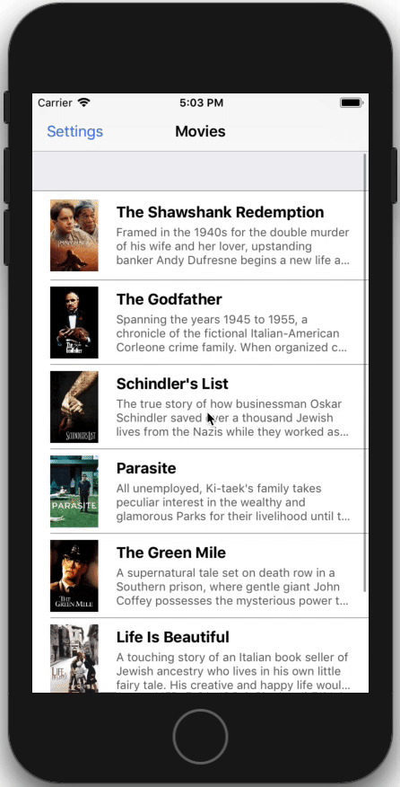

# 
Backward compatible Dark Mode

This is the demo project of the article written in [my blog](https://onswiftwings.com/posts/dark-mode/).

iOS 12                            |  iOS 13
:--------------------------------:|:-------------------------:
  |  
